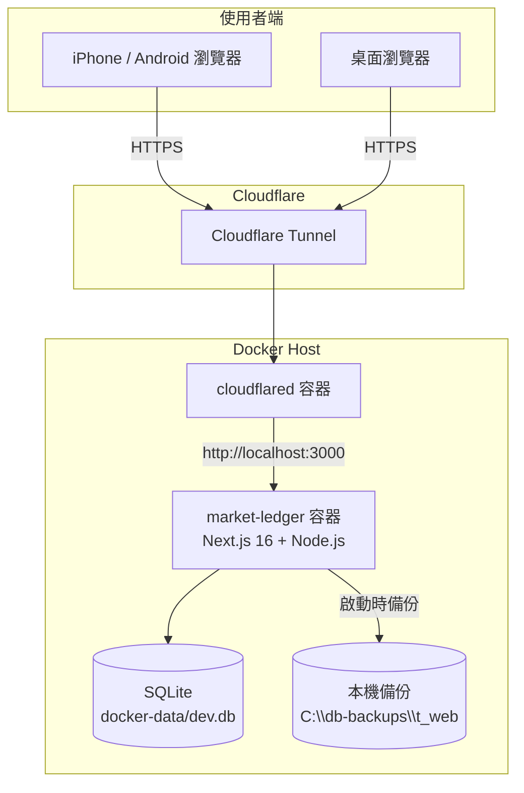
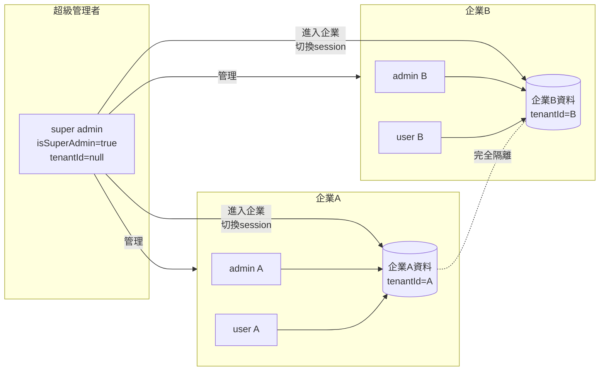
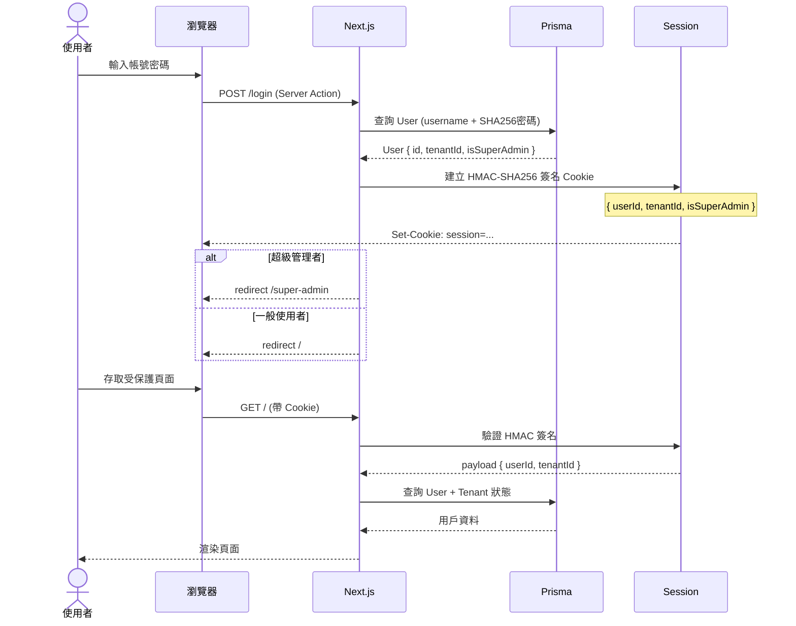
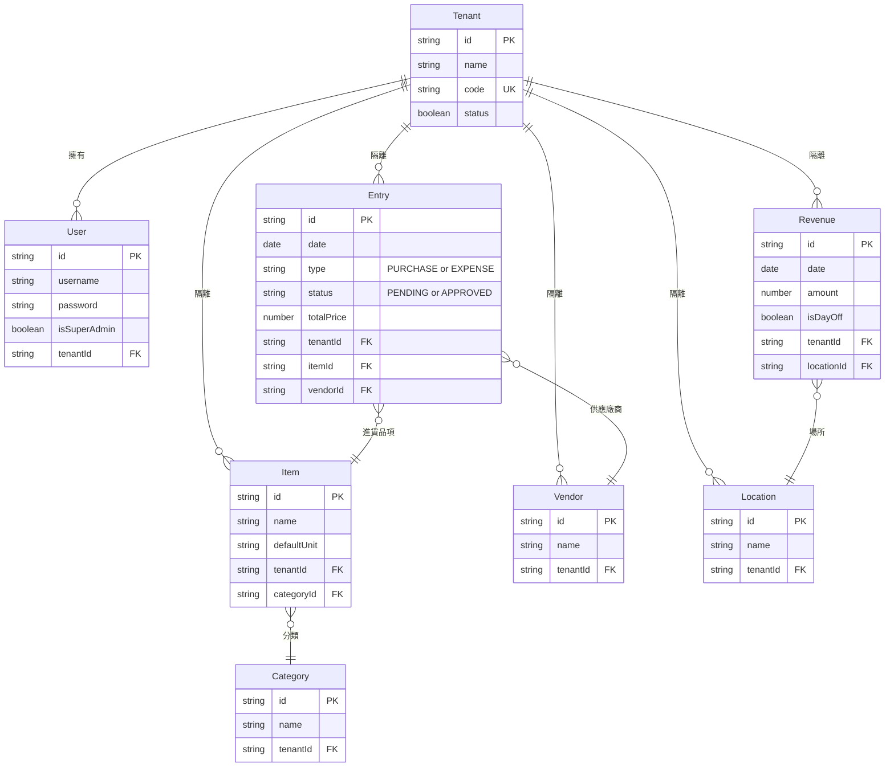

# 進貨存管系統

多租戶進銷存與營收管理平台，專為餐飲、零售、攤商設計。支援多企業隔離、行動裝置原生體驗，可透過 Cloudflare Tunnel 公開存取。

---

## 技術架構

| 層次 | 技術 |
|------|------|
| 前端框架 | Next.js 16 (App Router) + React 19 |
| 樣式 | Tailwind CSS v3 + Radix UI (shadcn/ui) |
| 資料庫 | SQLite（本機）via Prisma 5.22 |
| 認證 | HMAC-SHA256 簽名 Cookie Session |
| 部署 | Docker Compose + Cloudflare Tunnel |
| 圖表 | Recharts |

---

## 系統架構圖



---

## 多租戶架構

每個企業（Tenant）的資料完全隔離：所有業務資料表均含 `tenantId` 欄位，查詢時強制過濾。



---

## 認證流程



---

## 資料庫 ER 圖（核心模型）



---

## 目錄結構

```
t_web/
├── prisma/
│   ├── schema.prisma       # 資料庫模型定義
│   └── seed.ts             # 初始資料 (角色、super admin)
├── scripts/
│   ├── backup-db.ts        # 每日備份腳本（啟動時執行）
│   └── seed-demo-data.ts   # 展示用假資料（viewer 帳號用）
├── src/
│   ├── app/
│   │   ├── (protected)/    # 一般用戶功能（需登入）
│   │   │   ├── page.tsx            # 首頁儀表板
│   │   │   ├── entry/new/          # 新增進貨/支出
│   │   │   ├── inventory/          # 進貨記錄列表
│   │   │   ├── revenue/            # 每日營收記帳
│   │   │   ├── reports/            # 報表與分析
│   │   │   └── settings/           # 系統設定
│   │   ├── (super-admin)/  # 超級管理者後台
│   │   │   └── super-admin/
│   │   │       ├── page.tsx        # 系統總覽
│   │   │       └── tenants/        # 企業管理 CRUD
│   │   ├── actions/        # Next.js Server Actions
│   │   └── login/          # 登入頁面
│   ├── components/
│   │   ├── layout/
│   │   │   └── MobileNav.tsx       # 底部導覽列（iOS Safe Area 支援）
│   │   └── ui/                     # shadcn/ui 元件
│   └── lib/
│       ├── auth.ts         # 認證邏輯、getCurrentUser
│       ├── session.ts      # Cookie Session 簽名/驗證
│       └── prisma.ts       # Prisma Client 單例
├── docker-compose.yml      # Docker 部署配置
├── Dockerfile
└── Dockerfile.cloudflared
```

---

## 使用者角色

| 角色 | 代碼 | 權限 |
|------|------|------|
| 超級管理者 | ─ | 管理所有企業、進入任意企業、重設密碼 |
| 管理員 | admin | 所有功能 + 系統設定 |
| 操作員 | write | 新增/編輯進貨、營收記帳 |
| 查看者 | read | 僅查看儀表板、報表 |

---

## 備份策略

- **啟動時自動備份**：每次 `npm start` 或 `start:lan` 時執行 `scripts/backup-db.ts`
- **每日一次**：若當天已備份則跳過，避免重複
- **備份位置**：`C:\db-backups\t_web\dev_db_YYYYMMDD_HHMMSS.db`
- **保留策略**：
  - 最近 14 天：全部保留
  - 14 天 ~ 8 週：每週保留一份
  - 8 週 ~ 12 月：每月保留一份

---

## 快速開始

### 開發環境

```bash
# 安裝相依套件
npm install

# 建立環境變數
cp .env.example .env

# 資料庫初始化
npx prisma migrate dev
npx prisma db seed

# 啟動開發伺服器
npm run dev
```

### 正式部署（Docker）

```bash
# 建立並啟動容器（含 Cloudflare Tunnel）
docker compose up -d

# 查看 logs
docker compose logs -f market-ledger
```

### 本機啟動（不含 Docker）

```bash
# 區網模式（備份 + 啟動）
npm run start:lan
```

---

## 展示帳號

> 以下帳號可用於展示，資料涵蓋 2025-07-01 ～ 2026-02-07（飲料店業態，7 個月共 444 筆營收 + 660 筆進貨/支出）

| 用途 | 帳號 | 密碼 | 角色 |
|------|------|------|------|
| 超級管理者 | admin | admin112233 | 超級管理者 |
| 企業管理員 | 1111 | 0000 | 管理員 |
| 展示查看 | viewer | viewer123 | 查看者 |

---

## 環境變數

| 變數 | 說明 | 範例 |
|------|------|------|
| `DATABASE_URL` | SQLite 路徑 | `file:./prisma/dev.db` |
| `SESSION_SECRET` | Session 簽名金鑰（至少 32 字元） | 隨機字串 |
| `CLOUDFLARED_DIR` | cloudflared 憑證目錄 | `C:/Users/xxx/.cloudflared` |

---

## 行動裝置支援

- **iOS Safe Area**：底部導覽列自動適應 iPhone 的 Home Indicator 空間
- **防縮放**：輸入欄位字型大小 ≥ 16px，防止 iOS 自動縮放
- **觸控優化**：所有互動元素觸控區域 ≥ 44×44px（Apple HIG 標準）
- **PWA 支援**：可加入 iPhone 主畫面，以獨立 App 模式運行
- **Viewport Fit**：支援瀏海/動態島 iPhone 的全螢幕顯示
